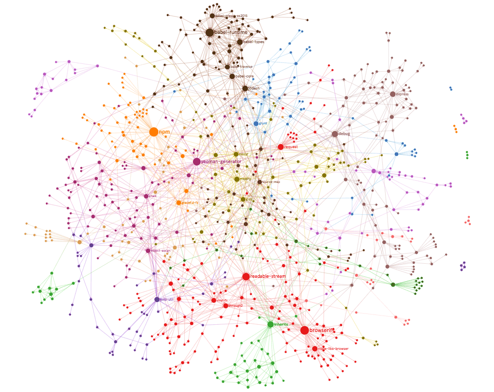

# Dependency Graph
This is a dependency graph. The very end product is SystemItem and an example of that could be seen in <I>app/tests/test_system_item.py</I>.
The goal of this is to manage systems that have a large number of calculations that should happen in special order when an external event happens. Basically this mimics an ecosystem (or Excel), if you will. There are a lot of components in an ecosystem and when an external stimulus enters the system, it triggers a lot of reactions until the system comes to an equilibrium again. Trading alpha and risk models are also similar to an ecosystem with a lot of factors that can change as a result of external market events (e.g. a new bid, a new trade, etc.).<BR>
    
```Python
from system_item import DependencyResult, SystemItem


class USTreasuryBond(SystemItem):
    """A crude simulation of a US treasury bond."""

    def __init__(self) -> None:
        """Initialize."""
        super().__init__()
        self.add_float_column('price', 0)
        self.add_float_column('yield', 0)
        self.add_float_column('dv01', 0)
        self.add_integer_column('expiration', 0)
        self.wire()

    def price_to_yield(self, price_col: int, yield_col: int) -> DependencyResult:
        """Price to yield calculation."""
        price = self.get(column=price_col).get_value()
        yield_val = price / 100.0 * 1.5
        self.get(column=yield_col).set_value(yield_val)
        return DependencyResult.SUCCESS

    def yield_to_price(self, yield_col: int, price_col: int) -> DependencyResult:
        """Yield to price calculation."""
        yield_val = self.get(column=yield_col).get_value()
        price = yield_val / 1.5 * 100.0
        self.get(column=price_col).set_value(price)
        return DependencyResult.SUCCESS

    def price_to_dv01(self, price_col: int, dv01_col: int) -> DependencyResult:
        """Yield to price calculation."""
        price = self.get(column=price_col).get_value()
        self.get(column=dv01_col).set_value(price / 100.0)
        return DependencyResult.SUCCESS

    def dv01_action(self, dv01_col: int) -> DependencyResult:
        """Action taken when dv01 changes"""
        global SOMETHING_TO_CHANGE
        SOMETHING_TO_CHANGE *= 2
        return DependencyResult.SUCCESS

    def wire(self) -> None:
        """Setup the dependencies."""
        self.add_dependency('price', 'yield', self.price_to_yield)
        self.add_dependency('yield', 'price', self.yield_to_price)
        self.add_dependency('price', 'dv01', self.price_to_dv01)
        self.add_action('dv01', self.dv01_action)


us_bond = USTreasuryBond()

# Trigger circular price <-> yield dependency
us_bond.get(column='price').set_value(100.5)
# After the above line:
#     us_bond.get(column='price') == 100.5
#     us_bond.get(column='yield') == 1.50749999
#     us_bond.get(column='dv01') == 1.005
```

# Documentation
[Graph Documentation](DepGraph.md)<BR>

# Test/Example
[Dependency Test](app/tests/test_system_item.py)<BR>
[DataItem/ContainerItem Test](app/tests/test_data_item.py)
    
## [License](LICENSE.md)
